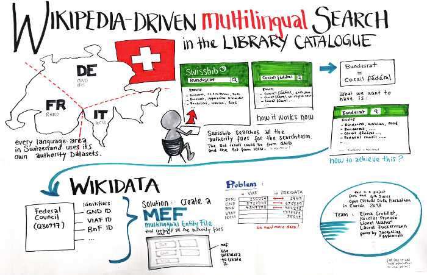

# Wikidata-based-multilingual-library-search
Project from the 4th Swiss Open Cultural Data Hackathon in Zurich 2018 

In Switzerland each linguistic region is working with different authority files for authors and organizations, situation which brings difficulties for the end user when he is doing a search. 

Goal of the Hackathon: work on a innovative solution as the library landscape search platforms will change in next years. Possible solution: Multilingual Entity File which links to GND, BnF, ICCU Authority files and Wikidata to bring end user information about authors in the language he wants. 

### Links

Demo https://test.swissbib.ch/Record/317008587 and you can search other records
   
Code https://github.com/swissbib/vufind/tree/feature/wikidata-based-multilingual
    
Final presentation http://make.opendata.ch/wiki/_media/project:presentation.pdf

4th SOCDH http://make.opendata.ch/wiki/event:2018-10

http://make.opendata.ch/wiki/project:mutilingual_data_search

### Team
- Elena Gretillat
- Nicolas Prongué
- Lionel Walter
- Laurel Zuckerman
- Jacqueline Martinelli

